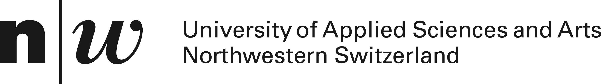
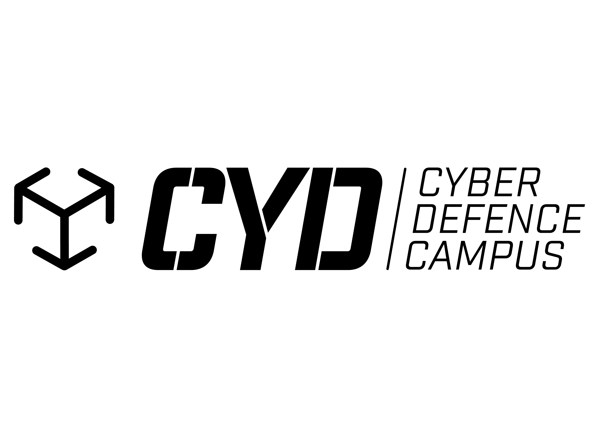

# Applied Machine Learning Days EPFL 2022<br>_Visual Disinformation and the Dark Side of Internet Memes_

This repository contains code and data for the workshop "Visual Disinformation and the Dark Side of Internet Memes" at the Applied Machine Learning Days EPFL 2022 ([Workshop Link](https://appliedmldays.org/events/amld-epfl-2022/workshops/visual-disinformation-and-the-dark-side-of-internet-memes)).

## Workshop Part 1

Click on the following badge to open the notebook in Google Colab (recommended):

[](https://colab.research.google.com/github/i4Ds/AMLD-2022-Visual-Disinformation/blob/main/part1.ipynb)

## Workshop Part 2

Click on the following badge to open the notebook in Google Colab (recommended):

[](https://colab.research.google.com/github/i4Ds/AMLD-2022-Visual-Disinformation/blob/main/part2.ipynb)

### Local Installation

Clone the repository and install dependencies. Warning: In this version you will see the solutions to some exercises (cell-hiding is a Colbab feature).

1) Clone the repository. To get the data you need [Git lfs](https://git-lfs.github.com/) while cloning the repository. Alternatively, you can download the data from this [Link](https://github.com/i4Ds/AMLD-2022-Visual-Disinformation/raw/main/data/GRU_202012.tar.gz)

(Optional) install git-lfs:
```
apt-get update
apt-get install git-lfs
```

Clone the repository:
```
git clone https://github.com/i4Ds/AMLD-2022-Visual-Disinformation.git
cd AMLD-2022-Visual-Disinformation
```

2) Install the dependencies
  
```
pip install -r requirements_part2.txt
```

3) Prepare the data (if not cloned via git-lfs)
  
Place the data into your preferred directory (default is ./data/) and unpack.

```
tar -xf ./data/GRU_202012.tar.gz --directory ./data/
```

4) Open Notebook: In the notebook you can skip the data-fetching / unpacking steps.

## Workshop Organizers

Raphael Meier, Scientific Project Manager, armasuisse S+T

Marco Willi, Research Associate, FHNW

Michael Graber, Professor, FHNW

## Supported By

[Armasuisse S+T](https://www.ar.admin.ch/de/armasuisse-wissenschaft-und-technologie-w-t/home.html)

<p align="left">
  
</p>

[FHNW - University of Applied Sciences and Arts Northwestern Switzerland](https://www.fhnw.ch/en)

<p align="left">
  
</p>


[Cyber Defence Campus](https://www.ar.admin.ch/en/armasuisse-wissenschaft-und-technologie-w-t/cyber-defence_campus.html)

<p align="left">
  
</p>


## Data Sources & References

### Data

Data for Part 1 are from:
- [The Hateful Memes Challenge](https://ai.facebook.com/tools/hatefulmemes/)
- [COCO Text](https://bgshih.github.io/cocotext/)
- [MS COCO](https://cocodataset.org/)
- [MultiOFF](https://aclanthology.org/2020.trac-1.6/)

Data for Part 2 are from:
- [Twitter Transparency](https://transparency.twitter.com/en/reports/information-operations.html). Any usage is subject to Twitter's [terms and conditions](https://developer.twitter.com/en/developer-terms)


### References

Radford, Alec, Jong Wook Kim, Chris Hallacy, Aditya Ramesh, Gabriel Goh, Sandhini Agarwal, Girish Sastry, et al. “Learning Transferable Visual Models From Natural Language Supervision.” ArXiv:2103.00020 [Cs], February 26, 2021. http://arxiv.org/abs/2103.00020.


Kiela, Douwe, Hamed Firooz, Aravind Mohan, Vedanuj Goswami, Amanpreet Singh, Pratik Ringshia, and Davide Testuggine. “The Hateful Memes Challenge: Detecting Hate Speech in Multimodal Memes.” ArXiv:2005.04790 [Cs], April 7, 2021. http://arxiv.org/abs/2005.04790.


Suryawanshi, Shardul, Bharathi Raja Chakravarthi, Mihael Arcan, and Paul Buitelaar. “Multimodal Meme Dataset (MultiOFF) for Identifying Offensive Content in Image and Text.” In Proceedings of the Second Workshop on Trolling, Aggression and Cyberbullying, 32–41. Marseille, France: European Language Resources Association (ELRA), 2020. https://aclanthology.org/2020.trac-1.6.
